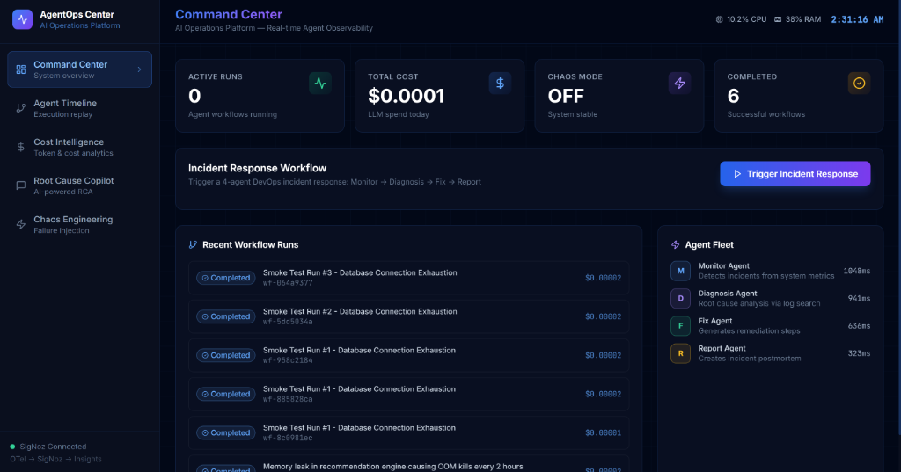
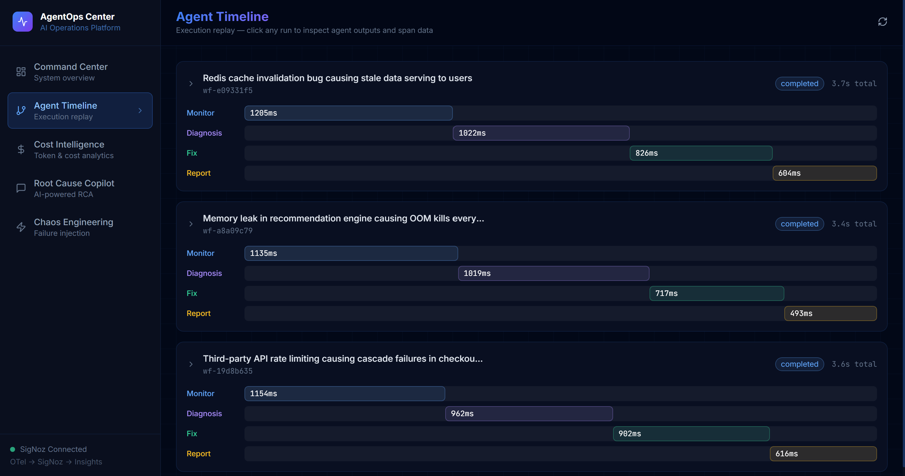
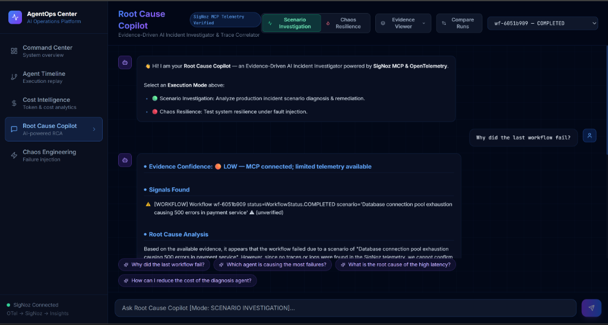
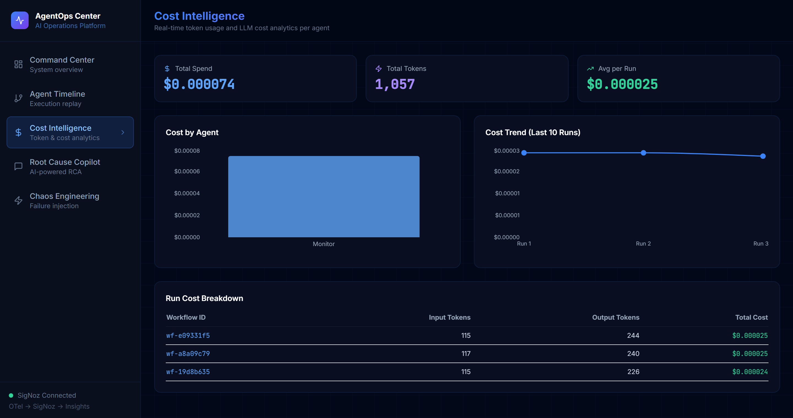
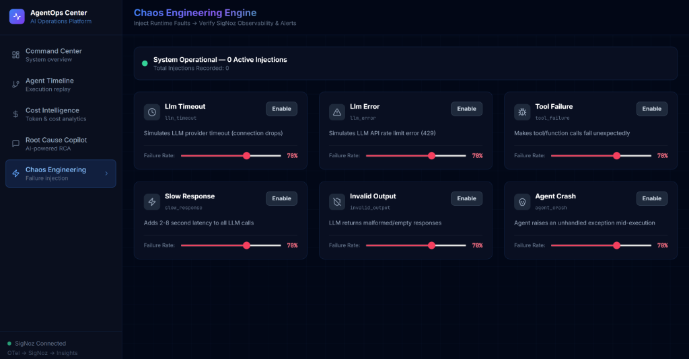

# 🔭 AgentOps Center

> **AI Operations Center for Multi-Agent Systems powered by OpenTelemetry, SigNoz & Model Context Protocol (MCP)**

Observe. Debug. Chaos Test. Explain.  
Gain end-to-end visibility into your AI agents using **real telemetry**, not guesses.

<p align="center">

[](https://wemakedevs.org)


</p>

---

# Why AgentOps Center?

Large Language Model applications are rapidly evolving into **multi-agent systems**.

Unfortunately...

Traditional observability platforms were built for APIs and microservices—not autonomous AI agents.

When an AI workflow fails, engineers often struggle to answer critical questions:

- Which agent failed?
- Which tool caused the issue?
- How much did the failed execution cost?
- Which prompt produced the incorrect response?
- Where is the evidence proving the diagnosis?

Most AI debugging tools rely on assumptions.

**AgentOps Center replaces assumptions with telemetry.**

Every LLM request, tool invocation, workflow transition, latency spike, token usage, and runtime error is instrumented using **OpenTelemetry**, stored inside **SigNoz**, and queried through the **SigNoz Model Context Protocol (MCP)** to produce evidence-backed Root Cause Analysis.

---

# Why This Project?

AgentOps Center demonstrates what modern AI operations should look like.

Instead of treating AI agents like black boxes, it treats them exactly like distributed cloud services.

Every decision becomes observable.

Every failure becomes traceable.

Every diagnosis is backed by real telemetry.

---

# Architecture

```
                                User
                                 │
                                 ▼
    ┌─────────────────────────────────────────────────────────┐
    │                   Next.js Dashboard                     │
    │                                                         │
    │  Command Center • Timeline • Copilot • Chaos Engine     │
    └────────────────────────────┬────────────────────────────┘
                                 │ HTTP / REST & SSE
                                 ▼
    ┌─────────────────────────────────────────────────────────┐
    │                    FastAPI Backend                      │
    │                                                         │
    │  • REST API & SSE Router                                │
    │  • OTel Auto/Manual Instrumentation                     │
    │  • SigNoz MCP Client                                    │
    │  • Chaos Fault Injector                                 │
    └──────────────┬───────────────────────────▲──────────────┘
                   │                           │
                   ▼                           │ MCP JSON-RPC
    ┌─────────────────────────────┐   ┌────────┴─────────────┐
    │  LangGraph 4-Agent Fleet    │   │  SigNoz MCP Server   │
    │                             │   │  (Sidecar Container) │
    │  Monitor ──► Diagnosis      │   └────────▲─────────────┘
    │     │           │           │            │
    │     ▼           ▼           │            │ REST Query API
    │    Fix   ──►  Report        │            │
    └──────────────┬──────────────┘   ┌────────┴─────────────┐
                   │ OTLP gRPC (4317) │    SigNoz Platform   │
                   ▼                  │   (ClickHouse Engine)│
    ┌─────────────────────────────┐   │                      │
    │   OTel Collector Pipeline   ├──►│ • Traces  • Metrics  │
    └─────────────────────────────┘   │ • Logs    • Alerts   │
                                      └──────────────────────┘


```

---

# End-to-End Execution Flow

```text
Incident Trigger
        │
        ▼
LangGraph executes 4-agent workflow
        │
        ▼
Every agent emits OpenTelemetry spans
        │
        ▼
OTLP Collector exports telemetry
        │
        ▼
SigNoz stores traces, metrics & logs
        │
        ▼
Copilot queries SigNoz MCP
        │
        ▼
Evidence Engine verifies telemetry
        │
        ▼
AI generates Root Cause Analysis
        │
        ▼
Confidence Score assigned
(HIGH / MEDIUM / LOW)
```

---

# Core Features

## Multi-Agent Incident Response

- 4-agent LangGraph workflow
- Sequential orchestration
- Workflow replay
- Agent state transitions
- Live execution tracking

---

## OpenTelemetry Native

Every execution automatically generates:

- LLM spans
- Tool spans
- Agent spans
- Workflow spans
- Cost metrics
- Token metrics
- Error events

Using official **GenAI Semantic Conventions**.

---

## Root Cause Copilot

Unlike traditional AI assistants...

The Copilot **does not hallucinate** telemetry.

Instead it:

- Connects to SigNoz MCP
- Queries traces
- Retrieves metrics
- Searches logs
- Builds verified evidence
- Assigns confidence levels

Every diagnosis is backed by observability data.

---

## Chaos Engineering

Inject failures into running AI workflows.

Supported scenarios include:

- LLM Timeout
- Tool Failure
- Slow Response
- Invalid Output
- Agent Crash
- LLM Exception

Observe how failures propagate through traces.

---

## Cost Intelligence

Track:

- Input Tokens
- Output Tokens
- USD Cost
- Latency
- Cost Per Agent
- Cost Per Workflow
- Total Runtime

---

# Why SigNoz?

SigNoz is the observability backbone of AgentOps Center.

Instead of relying on locally cached context, the platform retrieves live telemetry using the **SigNoz MCP Server**.

The Copilot queries:

- Distributed traces
- Metrics
- Logs
- Services
- Time-series data

Every recommendation references actual observability evidence.

---

# Application Screenshots

## Command Center

Real-time monitoring dashboard displaying active workflows, latency, AI cost, agent status, and operational metrics.



---

## Agent Timeline

Replay every workflow execution with Gantt-style visualization across all agents.



---

## Root Cause Copilot

Evidence-backed AI assistant powered by SigNoz MCP.



---

## Cost Intelligence

Monitor token usage and LLM cost in real time.



---

## Chaos Engineering

Inject production-style failures with a single click.



---

# Tech Stack

| Layer | Technologies |
|---------|--------------|
| Frontend | Next.js 15, React, Tailwind CSS |
| Backend | FastAPI, Python |
| AI Orchestration | LangGraph |
| Observability | OpenTelemetry |
| Telemetry Storage | SigNoz + ClickHouse |
| AI Diagnostics | SigNoz MCP |
| Containerization | Docker Compose |
| Database | ClickHouse |
| Collector | OpenTelemetry Collector |

---

# Repository Structure

```text
AgentOps-Center/

├── backend/
│   ├── agents/
│   ├── copilot/
│   ├── instrumentation/
│   ├── chaos/
│   ├── mcp/
│   └── main.py
│
├── frontend/
│
├── clickhouse/
│
├── otel-collector/
│
├── images/
│
├── docs/
│
├── docker-compose.yml
│
└── README.md
```

---

# Quick Start

## Prerequisites

- Docker
- Docker Compose
- Python 3.11+
- Groq/OpenAI/OpenRouter API Key

```bash
git clone https://github.com/swapitsneil/AgentOps-Center.git

cd AgentOps-Center

cp .env.example .env
```

Edit `.env`

```env
GROQ_API_KEY=your_api_key
```

Start everything:

```bash
docker compose up -d
```

Open:

| Service | URL |
|----------|-----|
| AgentOps Center | http://localhost:3000 |
| SigNoz | http://localhost:8080 |
| FastAPI Docs | http://localhost:8000/docs |
| MCP | http://localhost:18080/mcp |

---

# OpenTelemetry Instrumentation

AgentOps Center follows the OpenTelemetry GenAI Semantic Conventions to ensure standardized AI observability.

Every workflow emits structured telemetry for:

- LLM Requests
- Tool Invocations
- Agent Transitions
- Workflow Execution
- Cost Tracking
- Token Usage
- Errors & Exceptions

Example span attributes:

```json
{
  "gen_ai.system": "groq",
  "gen_ai.operation.name": "chat",
  "gen_ai.request.model": "llama-3.1-8b-instant",
  "gen_ai.usage.input_tokens": 142,
  "gen_ai.usage.output_tokens": 89,
  "gen_ai.usage.cost_usd": 0.0000071,
  "agent.name": "diagnosis_agent",
  "agent.workflow_id": "wf-86785cb5",
  "agent.node": "diagnosis"
}
```

These traces are exported through the OpenTelemetry Collector and stored inside SigNoz for querying through MCP.

---

# SigNoz MCP Integration

AgentOps Center integrates directly with the **SigNoz Model Context Protocol (MCP) Server**.

Instead of generating explanations from local context alone, the Root Cause Copilot queries live observability data using MCP.

Supported MCP capabilities include:

- Service Discovery
- Trace Search
- Metrics Query
- Log Search
- Time-Series Retrieval
- Error Investigation

Workflow:

```text
Root Cause Copilot
        │
        ▼
SigNoz MCP Client
        │
        ▼
JSON-RPC Request
        │
        ▼
SigNoz MCP Server
        │
        ▼
SigNoz Query Service
        │
        ▼
ClickHouse
        │
        ▼
Verified Evidence
        │
        ▼
Evidence-Based Diagnosis
```

The Copilot assigns confidence based on telemetry availability:

| Confidence | Meaning |
|------------|---------|
| 🟢 HIGH | Strong evidence from traces, logs and metrics |
| 🟡 MEDIUM | Partial telemetry available |
| 🟠 LOW | MCP connected but limited telemetry |
| 🔴 NONE | MCP unavailable or telemetry missing |

---

# API Endpoints

| Method | Endpoint | Description |
|---------|----------|-------------|
| GET | `/health` | Health status |
| GET | `/api/runs` | List workflow runs |
| POST | `/api/runs/trigger` | Trigger new workflow |
| GET | `/api/runs/{id}` | Workflow details |
| GET | `/api/timeline/{id}` | Agent execution timeline |
| GET | `/api/metrics` | Cost & token analytics |
| POST | `/api/copilot/ask` | Root Cause Copilot |
| POST | `/api/chaos/inject` | Inject failures |

---

# Demo Walkthrough

The following steps demonstrate the complete AgentOps workflow.

### Step 1

Start the platform.

```bash
docker compose up -d
```

---

### Step 2

Open the Command Center.

```
http://localhost:3000
```

---

### Step 3

Trigger a workflow.

The LangGraph workflow executes:

```
Monitor Agent
      ↓
Diagnosis Agent
      ↓
Fix Agent
      ↓
Report Agent
```

---

### Step 4

Observe OpenTelemetry traces flowing into SigNoz.

Open:

```
http://localhost:8080
```

View:

- Traces
- Metrics
- Logs
- Cost
- Services

---

### Step 5

Inject failures.

Examples:

- LLM Timeout
- Slow Response
- Tool Failure
- Invalid Output
- Agent Crash

Observe new spans appearing automatically.

---

### Step 6

Open Root Cause Copilot.

Ask:

> Why did this workflow fail?

The Copilot retrieves verified telemetry through SigNoz MCP before generating its explanation.

---

# Testing

The platform includes automated tests covering API functionality, workflow orchestration, MCP compatibility, Copilot behavior and Chaos Engineering.

Verified test suites include:

- API Tests
- Workflow Tests
- MCP Compatibility
- Chaos Engine
- Root Cause Copilot

Example:

```bash
pytest tests -v
```

Example output:

```
51 PASSED
0 FAILED
100% PASS RATE
```

---

# Performance

Release Candidate Verification:

| Category | Status |
|----------|--------|
| Docker Services | ✅ Healthy |
| MCP Integration | ✅ Connected |
| OpenTelemetry | ✅ Instrumented |
| Frontend | ✅ Operational |
| Backend | ✅ Operational |
| Chaos Engine | ✅ Verified |
| API Tests | ✅ Passing |
| Memory Leaks | ✅ None Detected |
| Thread Blocking | ✅ None Detected |

---

# Security

AgentOps Center follows secure deployment practices.

- Environment variables for secrets
- No API keys committed
- Non-root Docker containers
- Explicit CORS configuration
- Health checks for every service
- Safe MCP authentication
- Docker network isolation

---

# Future Roadmap

Planned improvements include:

- Kubernetes deployment
- Multi-tenant architecture
- Slack & Microsoft Teams alerts
- Distributed Agent Topology Graph
- Auto-remediation workflows
- Historical RCA comparison
- Prompt version tracking
- Fine-grained RBAC
- Grafana integration
- AI workflow benchmarking

---

# Project Highlights

✅ Multi-Agent AI Operations Platform

✅ LangGraph Workflow Orchestration

✅ OpenTelemetry GenAI Instrumentation

✅ SigNoz Observability

✅ SigNoz MCP Integration

✅ Evidence-Based Root Cause Analysis

✅ Chaos Engineering

✅ Cost Intelligence

✅ Dockerized Deployment

✅ FastAPI + Next.js

---

# Why This Project Matters

As AI systems become increasingly autonomous, traditional monitoring approaches are no longer sufficient.

AgentOps Center demonstrates how modern AI applications can adopt production-grade observability practices by combining:

- Multi-Agent Orchestration
- Distributed Tracing
- AI Cost Intelligence
- Telemetry-Based Diagnostics
- Chaos Engineering

The result is an observability platform where every AI decision is measurable, traceable and explainable.

---

# Built With

- Python
- FastAPI
- LangGraph
- Next.js
- React
- Tailwind CSS
- OpenTelemetry
- SigNoz
- SigNoz MCP
- ClickHouse
- Docker Compose

---

# AI Usage Declaration

This project was developed with AI-assisted engineering for productivity and documentation.

AI tools were used for:

- Initial boilerplate generation
- Documentation refinement
- Architecture brainstorming
- Code suggestions

All architecture decisions, implementation, debugging, OpenTelemetry instrumentation, SigNoz MCP integration, testing and final verification were reviewed, modified and validated manually.

A detailed declaration is available in:

```
HACKATHON_NOTES.md
```

---

# Acknowledgements

Special thanks to:

- OpenTelemetry Community
- SigNoz Team
- LangGraph
- FastAPI
- Next.js
- WeMakeDevs
- Agents of SigNoz Hackathon 2026

for building the open-source ecosystem that made this project possible.

---

# Contributing

Contributions are welcome.

1. Fork the repository

2. Create a feature branch

```bash
git checkout -b feature/my-feature
```

3. Commit your changes

```bash
git commit -m "Add awesome feature"
```

4. Push your branch

```bash
git push origin feature/my-feature
```

5. Open a Pull Request

---

# License

This project is licensed under the **MIT License**.

See the `LICENSE` file for details.

---

# Final Thoughts

AgentOps Center is an exploration of what AI observability should look like in production.

Rather than relying on assumptions or opaque reasoning, it combines **OpenTelemetry**, **SigNoz**, and the **Model Context Protocol (MCP)** to produce evidence-backed insights into complex multi-agent workflows.

Whether you're debugging an autonomous agent, tracking LLM costs, investigating failures, or experimenting with chaos engineering, AgentOps Center demonstrates how modern AI systems can be observed with the same rigour as distributed cloud applications.

---

<p align="center">

### Built for the **Agents of SigNoz Hackathon 2026**

**Observe • Diagnose • Improve**

By **Swapnil Nicolson Dadel**

⭐ If you found this project interesting, consider giving it a star.

</p>
